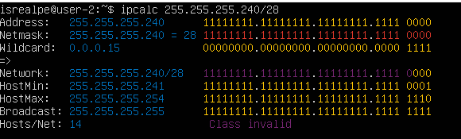
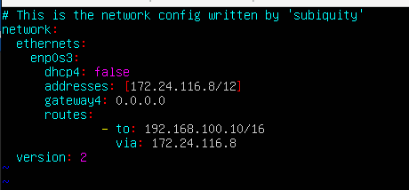
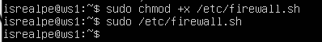
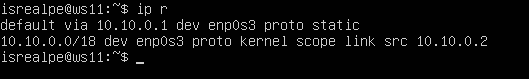
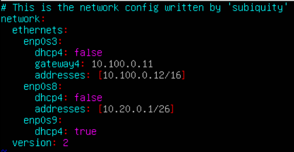
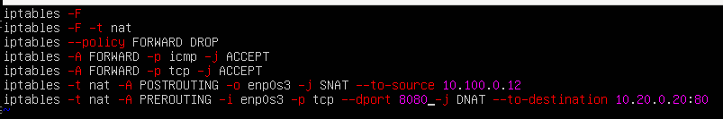
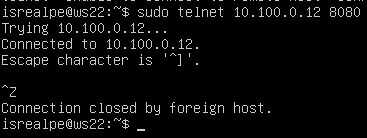

# Сети в Linux
*****
## Содержание
1. [Инструмент ipcalc](#инструмент-ipcalc)
2. [Статическая маршрутизация между двумя машинами](#статическая-маршрутизация-между-двумя-машинами)
*****
## Инструмент ipcalc
#### 1.1 Сети и маски
##### 1) адрес сети 192.167.38.54/13
`-` 192.160.0.1

##### 2) 255.255.255.0 
`-` в префиксной - /24

`-` в двоичной - 11111111.11111111.11111111.00000000

##### /15 
`-` в обычной - 255.254.0.0

`-` в двоичной - 11111111.11111110.00000000.00000000

##### 11111111.11111111.11111111.11110000 
`-` в обычной - 255.255.255.240

`-` в префиксной - /24

##### 3) 12.167.38.4
Маска /8:

`-` HostMin: 12.0.0.1

`-` HostMax: 12.255.255.254

Маска 11111111.11111111.00000000.00000000:

`-` HostMin: 12.167.0.1

`-` HostMax: 12.167.255.254

Маска 255.255.254.0:

`-` HostMin: 12.167.38.1

`-` HostMax: 12.167.39.254

Маска /4:

`-` HostMin: 0.0.0.1

`-` HostMax: 15.255.255.254

#### localhost

`Localhost` — это имя хоста, которое относится к локальному компьютеру, который в настоящее время выполняет запрос. Для него зарезервированы IP адреса от `127.0.0.1` до `127.255.255.254`. Значит, можно обратиться к приложениям, работающим на localhost, по следующим IP: `127.0.0.2`, `127.1.0.1`
Существуют адреса, называемые лакальными адресами замыкания на себя. Вместо того, чтобы идентифицированить другое устройство в инете, адрес замыкания на себя ссылается на устройство в частной локальной сети. Т.е. такие адреса относятся к localhost. Проверим:

`-` 194.34.23.100 - нет пометки loopback

`-` 127.0.0.2 - есть пометка loopback

`-` 127.1.0.1 - есть пометка loopback

`-` 128.0.0.1 - нет пометки loopback

#### Диапазоны и сегменты сетей
##### 1)

`-` частные: 10.0.0.45, 192.168.4.2, 172.20.250.4, 172.16.255.255, 10.10.10.10

`-` публичные: 134.43.0.2, 172.0.2.1, 192.172.0.1, 172.68.0.2, 192.169.168.1

##### 2)

Возможные адреса шлюзов должны лежать от 10.10.0.1 до 10.10.63.255
Значит, подходят 10.10.0.2, 10.10.10.10, 10.10.1.255

*****
## Статическая маршрутизация между двумя машинами
##### Поднять 2 машины ws1 и ws2
##### `$ ip a`

Существующие сетевые интерфейсы:

`-` lo (loopback) - для подключения по сети к этому же компьютеру

`ws1: 127.0.0.1/8`
`ws2: 127.0.0.1/8`

`-` enp0s3 - сетевой адаптер Ethernet

`ws1: 10.0.2.15/24`

`ws2: 10.0.2.15/24`

2048

#### 2.1 Добавление статического маршрута вручную

ws1: `$sudo ip r a 172.24.116.8 via 192.168.100.10 dev enp0s3`

ws2: `$sudo ip r a 192.168.100.10 via 172.24.116.8 dev enp0s3`

пинг:

#### 2.2. Добавление статического маршрута с сохранением

`-` Добавить статический маршрут от одной машины до другой с помощью файла etc/netplan/00-installer-config.yaml

##### ws1:

##### ws2:

`-` Пропинговать соединение между машинами

##### ws1:

##### ws2:

для того, чтобы все работало, нужно было поменять в настройках сеть поменять с NAT на внутреннюю

*****

## Утилита iperf3

#### 3.1 Скорость соединения

`-` 8 Mbps == 1 MB/s

`-` 100 MB/s == 100000 Kbps

`-` 1 Gbps == 1000 Mbps

#### 3.2 Утилита iperf3

ws1 выступает в роли сервера, ws2 - в роли клиента

для того, чтобы все работало, нужно убрать порт 5201 из исключений брандмауэра:

`$sudo ufw allow 5201`
`$sudo ufw enable`

для ws1 `$iperf3 -s`

для ws2 `$iperf3 -c 192.168.100.10`

## Сетевой экран

#### Утилита iptables

на ws1 и ws2 созданы firewall.sh, имитирующие фаерволл

Нужно добавить в файл подряд следующие правила:

1) на ws1 применить стратегию когда в начале пишется запрещающее правило, а в конце пишется разрешающее правило (это касается пунктов 4 и 5)

2) на ws2 применить стратегию когда в начале пишется разрешающее правило, а в конце пишется запрещающее правило (это касается пунктов 4 и 5)

3) открыть на машинах доступ для порта 22 (ssh) и порта 80 (http)

4) запретить echo reply (машина не должна "пинговаться”, т.е. должна быть блокировка на OUTPUT)

5) разрешить echo reply (машина должна "пинговаться")

действия iptables:

-F - очистить все правила;

-X - удалить цепочку;

ACCEPT - разрешить прохождение пакета дальше по цепочке правил;

REJECT - отклонить пакет, отправителю будет отправлено сообщение, что пакет был отклонен;

`-` ws1:

`-` ws2:

запуск на ws1:

запуск на ws2:

разница будет в том, что для ws1 будет выполнено только запрещающее правило, а для ws2 - разрешающее

#### 4.2 Утилита nmap

*****

## 5. Статическая маршрутизация сети

поднять 5 машин: ws11, ws21, ws22, r1, r2

#### 5.1. Настройка адресов машин

##### файл `/etc/netplan/00-installer-config.yaml`

`-` ws11:

`-` ws21:

`-` ws22:

`-` r1:

`-` r2:

перезапуск сети с помощью `$sudo netplan apply`

##### выполнение `ip -4 a`

`-` ws11:

`-` ws21:

`-` ws22:

`-` r1:

`-`r2:

##### пропинговать ws22 с ws21 и r1 с ws11

`-` ws22 с ws21:

`-` r1 и ws11:

#### 5.2 Включение переадресации IP-адресов

##### вызов команды `sysctl -w net.ipv4.ip_forward=1` на роутерах для включения переадресации ip (при таком подходе переадресация не будет работать после перезагрузки системы)

`-` r1:

`-` r2:

##### в файл `/etc/sysctl.conf` добавить строку `net.ipv4.ip_forward = 1` (при использовании этого подхода, IP-переадресация включена на постоянной основе)

`-` r1:

`-` r2:

`sudo sysctl -p`

#### 5.3 Установка маршрута по умолчанию

##### Настроить маршрут по-умолчанию (шлюз) для рабочих станций. Для этого добавить `default` перед IP роутера в файле конфигураций. Вызвать `ip r` и показать, что добавился маршрут в таблицу маршрутизации

`-` ws11:

`-` ws21:

`-` ws22:

чтобы пинг проходил через соседнюю сеть, были добавлены шлюзы для роутеров

`-` r1:

`-` r2:

##### Пропинговать с ws11 роутер r2 и показать на r2, что пинг доходит. Для этого использовать команду:
`tcpdump -tn -i eth1`

#### 5.4 Добавление статических маршрутов

##### Добавить в роутеры r1 и r2 статические маршруты в файле конфигураций

`-` r1:

`-` r2:

##### Вызвать ip r и показать таблицы с маршрутами на обоих роутерах

`-` r1:

`-` r2:

##### Запустить команды на ws11:
`ip r list 10.10.0.0/[маска сети]` и `ip r list 0.0.0.0/0`

Маршрут подбирается по таблице марштрутизаторов. Если маршрут выбран успешно то он будет передан. Если не успешно - пакет не будет передан. Если несколько совпадений - то для переадсресации будет выбран маршрут с самой длинной маской.

#### 5.5. Построение списка маршрутизаторов

##### Запустить на r1 команду дампа:
`tcpdump -tnv -i eth0`

##### При помощи утилиты traceroute построить список маршрутизаторов на пути от ws11 до ws21

Принцип построения пути при помощи traceroute:
Для определения промежуточных маршрутизаторов traceroute отправляет серию пакетов данных целевому узлу, при этом каждый раз увеличивая на 1 значение поля TTL («время жизни»). Это поле обычно указывает максимальное количество маршрутизаторов, которое может быть пройдено пакетом. Первый пакет отправляется с TTL, равным 1, и поэтому первый же маршрутизатор возвращает обратно сообщение ICMP, указывающее на невозможность доставки данных. Traceroute фиксирует адрес маршрутизатора, а также время между отправкой пакета и получением ответа (эти сведения выводятся на монитор компьютера). Затем traceroute повторяет отправку пакета, но уже с TTL, равным 2, что позволяет первому маршрутизатору пропустить пакет дальше.
Процесс повторяется до тех пор, пока при определённом значении TTL пакет не достигнет целевого узла. При получении ответа от этого узла процесс трассировки считается завершённым.

#### 5.6. Использование протокола ICMP при маршрутизации

##### Запустить на r1 перехват сетевого трафика, проходящего через eth0 с помощью команды:
`tcpdump -n -i eth0 icmp`

##### Пропинговать с ws11 несуществующий IP (например, 10.30.0.111) с помощью команды:
`ping -c 1 10.30.0.111`

*****

## 6. Динамическая настройка IP с помощью DHCP

##### Для r2 настроить в файле `/etc/dhcp/dhcpd.conf` конфигурацию службы DHCP:

##### указать адрес маршрутизатора по-умолчанию, DNS-сервер и адрес внутренней сети

##### в файле resolv.conf прописать nameserver 8.8.8.8

##### Перезагрузить службу DHCP командой `systemctl restart isc-dhcp-server`.

##### Машину ws21 перезагрузить при помощи `reboot` и через `ip a` показать, что она получила адрес. Также1 пропинговать ws22 с ws21.

##### Указать MAC адрес у ws11, для этого в `etc/netplan/00-installer-config.yaml` надо добавить строки: `macaddress: 10:10:10:10:10:BA`, `dhcp4: true`

##### Для r1 настроить аналогично r2, но сделать выдачу адресов с жесткой привязкой к MAC-адресу (ws11). Провести аналогичные тесты

`-` `/etc/dhcp/dhcpd.conf`:

`-` `/etc/resolve.conf`:

`-` `systemctl restart isc-dhcp-server`:

`-` `ip a`:

##### Запросить с ws21 обновление ip адреса

`-` `ip a` до обновления:

`-` `ip a` после обновления:

##### В отчёте описать, какими опциями DHCP сервера пользовались в данном пункте.

`sudo dhclint eth0 -r` - удалить IP

`sudo dhclint eth0` - назначить IP

*****

## 7. NAT

##### В файле `/etc/apache2/ports.conf` на ws22 и r1 изменить строку `Listen 80` на `Listen 0.0.0.0:80`, то есть сделать сервер Apache2 общедоступным

`-` ws22:

`-` r1:

##### Запустить веб-сервер Apache командой `service apache2 start` на ws22 и r1

`-` ws22:

`-` r1:

##### Добавить в фаервол, созданный по аналогии с фаерволом из Части 4, на r2 следующие правила:

1) удаление правил в таблице filter - iptables -F

2) удаление правил в таблице "NAT" - iptables -F -t nat

3) отбрасывать все маршрутизируемые пакеты - iptables --policy FORWARD DROP

##### Запускать файл также, как в Части 4

##### Проверить соединение между ws22 и r1 командой ping. При запуске файла с этими правилами, ws22 не должна "пинговаться" с r1

##### Добавить в файл ещё одно правило:

4) разрешить маршрутизацию всех пакетов протокола ICMP

##### Запускать файл также, как в Части 4

##### Проверить соединение между ws22 и r1 командой ping. При запуске файла с этими правилами, ws22 должна "пинговаться" с r1

##### Добавить в файл ещё два правила:

5) включить SNAT, а именно маскирование всех локальных ip из локальной сети, находящейся за r2 (по обозначениям из Части 5 - сеть 10.20.0.0)
Совет: стоит подумать о маршрутизации внутренних пакетов, а также внешних пакетов с установленным соединением

6) включить DNAT на 8080 порт машины r2 и добавить к веб-серверу Apache, запущенному на ws22, доступ извне сети
Совет: стоит учесть, что при попытке подключения возникнет новое tcp-соединение, предназначенное ws22 и 80 порту

`-` На r2 в `/etc/apache2/ports.conf` надо добавить `Listen 0.0.0.0:8080`

##### Запускать файл также, как в Части 4

##### Проверить соединение по TCP для SNAДополнительно. Знакомство с SSH TunnelsT, для этого с ws22 подключиться к серверу Apache на r1 командой:

`telnet [адрес] [порт]`

##### Проверить соединение по TCP для DNAT, для этого с r1 подключиться к серверу Apache на ws22 командой telnet (обращаться по адресу r2 и порту 8080)

`-` r1:

`-` ws22:

*****

## 8. Дополнительно. Знакомство с SSH Tunnels

##### Запустить на r2 фаервол с правилами из Части 7

##### Запустить веб-сервер Apache на ws22 только на localhost (то есть в файле `/etc/apache2/ports.conf` изменить строку `Listen 80` на `Listen localhost:80`)

##### Воспользоваться Local TCP forwarding с ws11 до ws22, чтобы получить доступ к веб-серверу на ws22 с ws11

##### Воспользоваться Remote TCP forwarding c ws21 до ws22, чтобы получить доступ к веб-серверу на ws22 с ws21

##### Для проверки, сработало ли подключение в обоих предыдущих пунктах, перейдите во второй терминал (например, клавишами Alt + F2) и выполните команду:
`telnet 127.0.0.1 [локальный порт]`

`-` ws11:

`-` ws21:

*****